# LivePage Backend - Architecture Documentation

## 🏗️ System Architecture

### High-Level Architecture Diagram

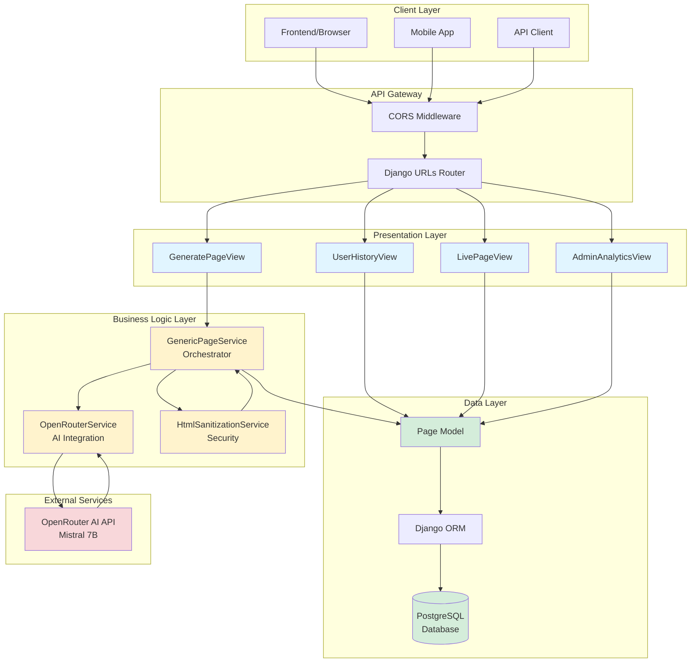

---

## 🔄 Request Flow Diagrams

### Page Generation Flow

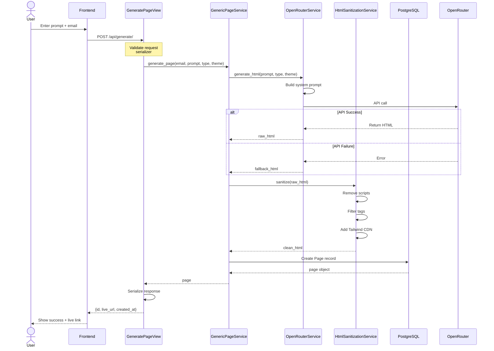

---

### Live Page Rendering Flow

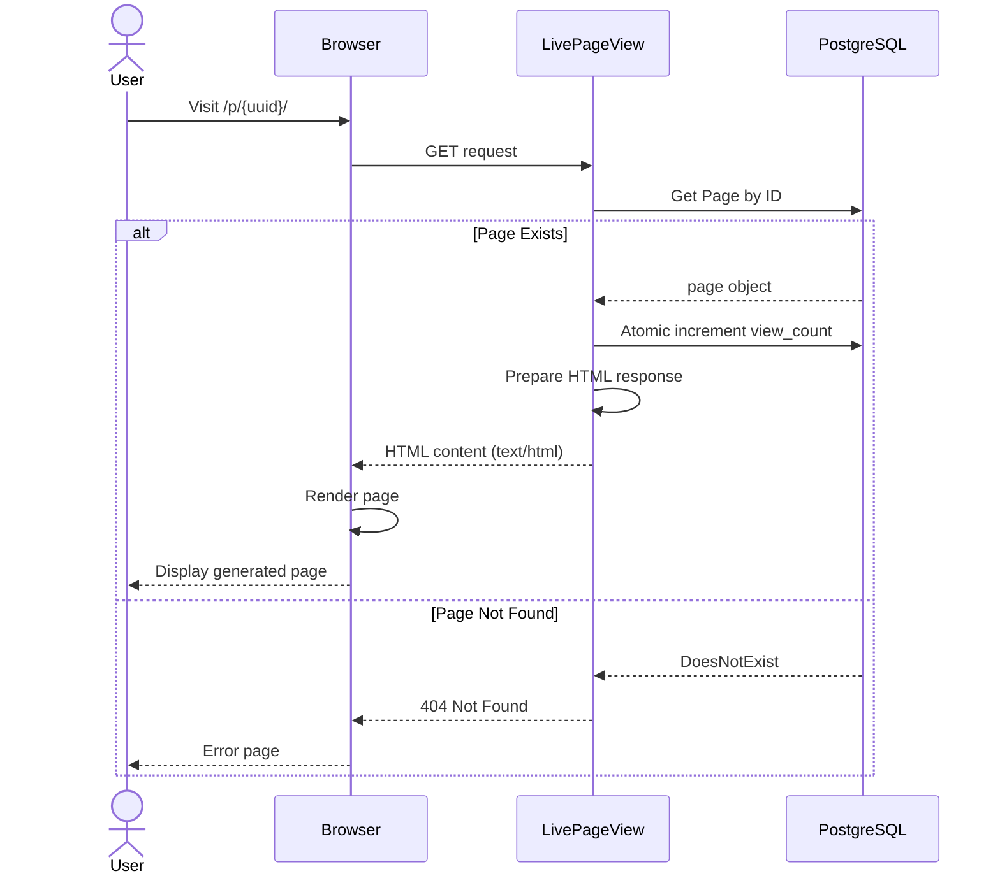

---

## 📊 Data Flow Architecture

### Component Interaction

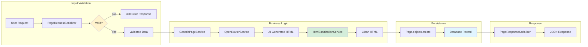

---

## 🗄️ Database Schema

### Entity Relationship Diagram

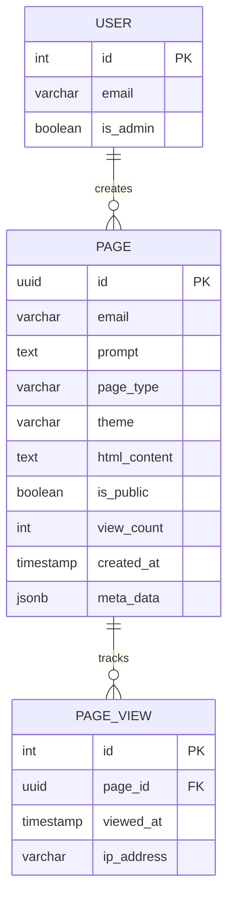

**Notes:**
- `PAGE_VIEW` entity not currently implemented (future enhancement)
- `USER` table managed by Django auth system
- Current implementation tracks views via `view_count` field

---

## 🔐 Security Architecture

### Security Layers

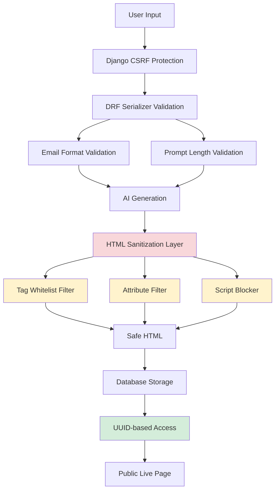

### Sanitization Process

```mermaid
flowchart LR
    A[AI Generated HTML] --> B{Contains Scripts?}
    B -->|Yes| C[Remove Script Tags]
    B -->|No| D[Tag Whitelist Check]
    C --> D
    
    D --> E{All Tags Allowed?}
    E -->|No| F[Strip Disallowed Tags]
    E -->|Yes| G[Attribute Check]
    F --> G
    
    G --> H{Safe Attributes?}
    H -->|No| I[Remove Unsafe Attrs]
    H -->|Yes| J[Tailwind CDN Check]
    I --> J
    
    J --> K{CDN Present?}
    K -->|No| L[Inject Tailwind CDN]
    K -->|Yes| M[Clean HTML Output]
    L --> M
    
    style C fill:#f8d7da
    style F fill:#f8d7da
    style I fill:#f8d7da
    style M fill:#d4edda
```

---

## 🔄 Service Layer Design Patterns

### Orchestrator Pattern

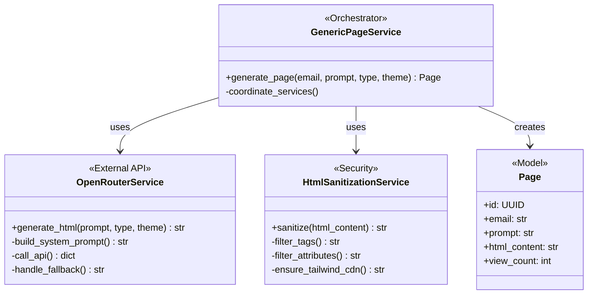

---

## 📡 API Architecture

### RESTful Endpoint Structure

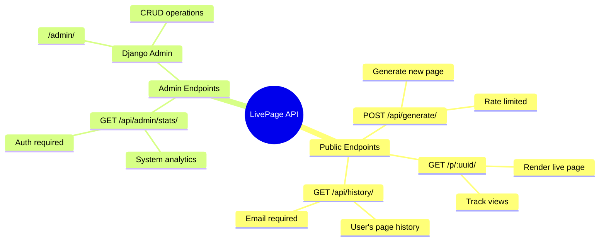

---

## 🚀 Deployment Architecture

### Recommended Production Setup

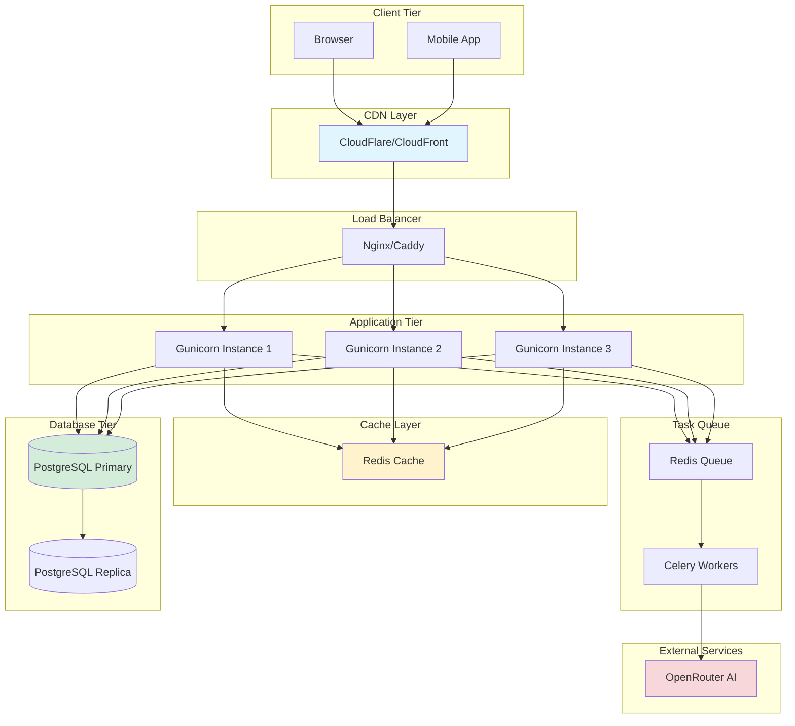

---

## 🔧 Technology Stack Layers

### Full Stack Overview

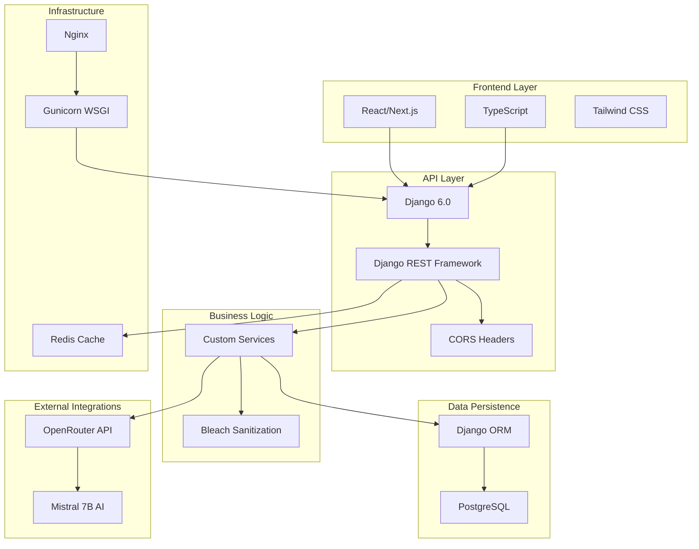

---

## 📈 Scalability Architecture

### Horizontal Scaling Strategy

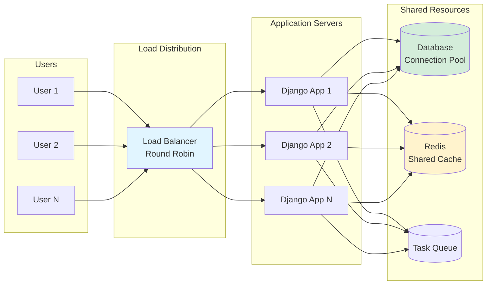

---

## 🔍 Monitoring Architecture

### Observability Stack (Recommended)

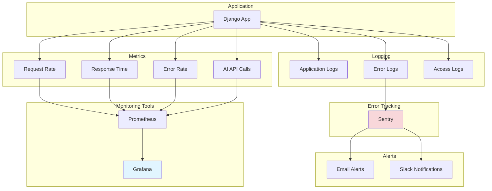

---

## 📊 Performance Optimization Layers

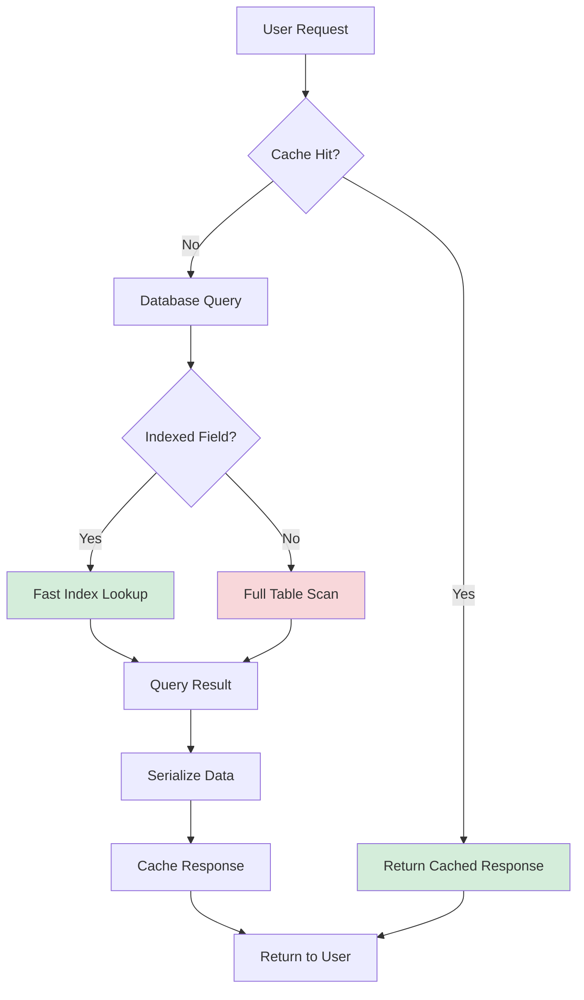

---

## 🔐 Authentication Flow (Future Enhancement)

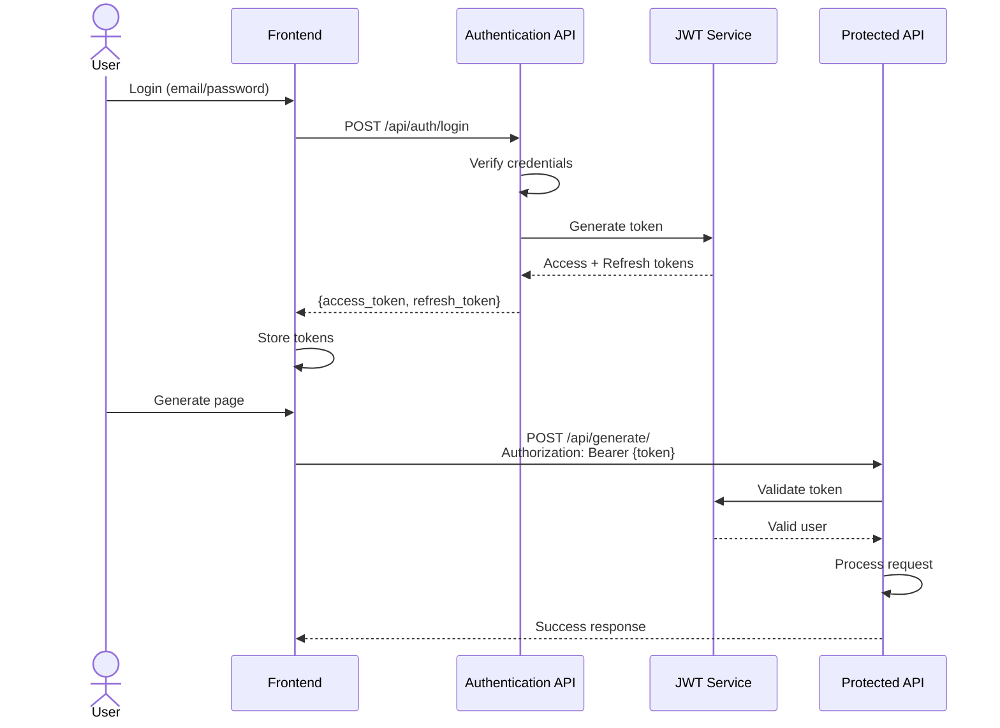

---

## 📝 Configuration Management

### Environment-Based Configuration

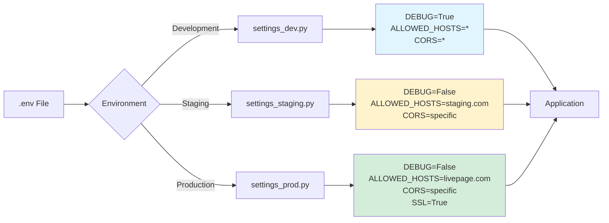

---

## 🎯 Summary

This architecture document provides comprehensive visual representations of:

1. **System Architecture** - High-level component interaction
2. **Request Flows** - Detailed sequence diagrams
3. **Data Flows** - Entity relationships and data movement
4. **Security Layers** - Protection mechanisms
5. **Service Patterns** - Design pattern implementations
6. **API Structure** - Endpoint organization
7. **Deployment Strategy** - Production infrastructure
8. **Scalability** - Horizontal scaling approach
9. **Monitoring** - Observability stack
10. **Performance** - Optimization strategies

### Key Architectural Principles

- ✅ **Separation of Concerns** - Clear layer boundaries
- ✅ **Service-Oriented Design** - Modular business logic
- ✅ **Defense in Depth** - Multiple security layers
- ✅ **Fail-Safe Defaults** - Graceful degradation
- ✅ **Stateless API** - Horizontal scalability
- ✅ **Database-Centric** - PostgreSQL as source of truth

---

**Architecture Version:** 1.0.0  
**Last Updated:** January 14, 2026  
**Maintained by:** LivePage Development Team
